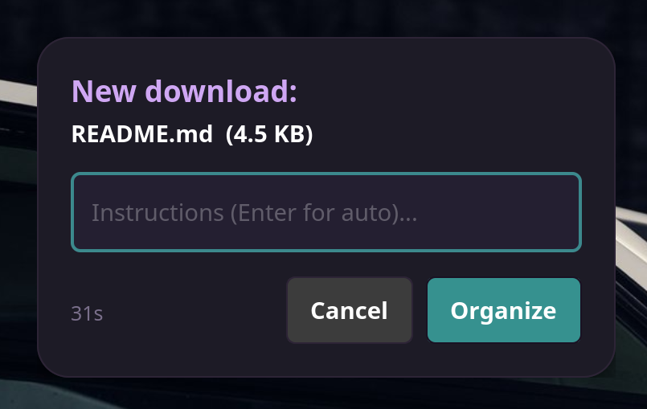
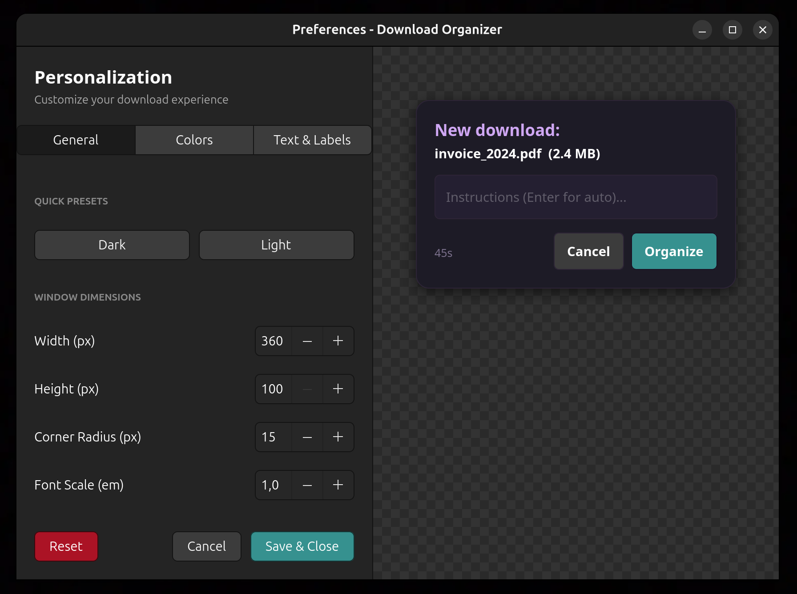

<div align="center">

# 📂 Smart Download Organizer


**AI-powered assistant that keeps your `Downloads` folder organized.**  
Powered by [**Agentify**](https://github.com/fa8i/Agentify).

</div>

---

## 🚀 Overview

**Smart Download Organizer** runs silently in the background, monitoring your downloads. When a new file arrives, it uses **[Agentify](https://github.com/fa8i/Agentify)** to understand your instructions and organize files automatically.

> [!NOTE]
> **Linux Only**: Designed for **Linux** (tested on Ubuntu/X11).



## ✨ Key Features

*   **🤖 AI-Powered**: If you write an instruction in the dialog (e.g., *"Move to invoices folder and rename to Invoice_January"*), the agent:
    *   Analyzes your request with a **fully configurable LLM**.
    *   Compatible with **OpenAI**, **DeepSeek**, **Anthropic (Claude)**, **Google Gemini**, and more (via [Agentify](https://github.com/fa8i/Agentify)).
    *   Can create folders, rename files, and move them to any subdirectory in your home folder.
    *   Can extract archive files if requested.
    *   Can delete files if you instruct it to (e.g., *"Delete this file"*).
*   **📂 Auto-Sorting**: Automatically categorizes files (Images, Docs, Videos) if no instruction is provided.
*   **🎨 Customizable UI**: Dark/Light modes, custom colors, and adjustable size.

## 📊 Performance

| Metric | Value |
| :--- | :--- |
| **Memory** | **~46 MB** |
| **CPU** | **< 1%** |
| **Startup** | **Instant** |

## 🛠️ Installation

1.  **Clone the repository**:
    ```bash
    git clone https://github.com/fa8i/download-organizer.git
    cd download-organizer
    ```

2.  **Run the installation script**:
    ```bash
    ./install.sh
    ```
    > [!NOTE]
    > The script will automatically check for system dependencies (`libcairo2-dev`, `pkg-config`, etc.), create a virtual environment, and install all necessary Python packages.

3.  **Done!**
    *   **Restart**: `systemctl --user restart download-organizer`
    *   **Logs**: `journalctl --user -u download-organizer -f`

## ⚙️ Configuration

### Visual Preferences
Launch the configuration tool:
```bash
./configure_ui.sh
```



### Advanced Config
All core settings, including LLM configuration, are managed via environment variables in a `.env` file. 

1.  **Copy the template**:
    ```bash
    cp .env.example .env
    ```
2.  **Configure your Agent**:
    Edit `.env` to set your `LLM_PROVIDER` (e.g., `openai`, `anthropic`, `gemini`), `LLM_MODEL` (e.g., `gpt-4o`, `claude-3-5-sonnet-20240620`), and the corresponding API key. 

Check `src/download_organizer/config.py` for folder paths and categories, and `src/download_organizer/prompts.py` to customize the agent's behavior and language.
